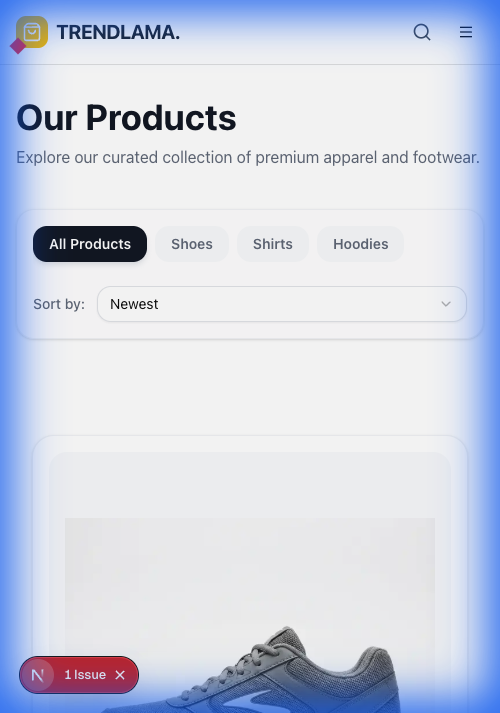
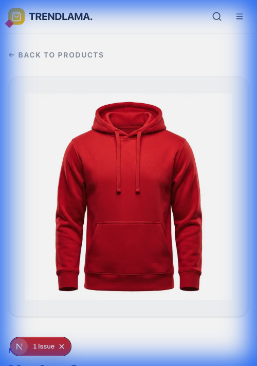
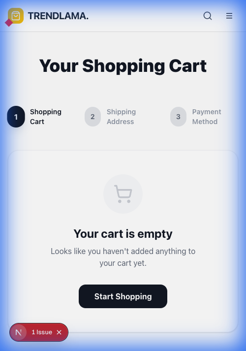

# TrendLama E-commerce (Local Mode)

TrendLama is a modern e-commerce application built with Next.js, featuring a complete shopping cart system, user authentication, and product catalog - all running in local mode without requiring a backend server.

## Screenshots

<div align="center">
  <h3>Homepage</h3>
  
  
  <h3>Product Listing</h3>
  
  
  <h3>Product Details</h3>
  
  
  <h3>Shopping Cart</h3>
  
</div>

## 🚀 Local Mode Features

This application has been refactored to run entirely in local mode, providing:

### ✅ **Local Storage Cart System**
- **Persistent Cart**: Cart data stored in browser localStorage
- **Cross-Session Persistence**: Cart survives browser restarts
- **Instant Updates**: No API calls needed for cart operations
- **Reliable Performance**: No network dependencies for core functionality

### ✅ **Local Product API**
- **Built-in Product Catalog**: Products served from Next.js API routes
- **Category Filtering**: Filter by hoodies, shoes, shirts, etc.
- **Product Details**: Complete product information with variants
- **Fast Loading**: Instant product data without external dependencies

### ✅ **User Authentication**
- **Clerk Integration**: Secure user authentication
- **Profile Management**: User profiles and session management
- **Guest Shopping**: Full functionality without login required
- **Seamless Experience**: Authentication enhances but doesn't block functionality

### ✅ **Modern UI/UX**
- **Responsive Design**: Optimized for all devices
- **Smooth Animations**: Professional interface with Tailwind CSS
- **TypeScript**: Full type safety throughout the application
- **Component Architecture**: Reusable, maintainable components

## Features

- **Local-First Architecture**: No backend server required
- **Shopping Cart**: Add, remove, and manage cart items with persistence
- **Product Catalog**: Browse products with filtering and sorting
- **User Authentication**: Secure login with Clerk (optional)
- **Responsive Design**: Mobile-first design approach
- **Multi-step Checkout**: Complete checkout flow with forms
- **TypeScript**: Full type safety and better developer experience
- **Fast Performance**: Instant loading without API delays

## Installation Procedure

### Prerequisites

- [Node.js](https://nodejs.org/) (v18.x or later recommended)
- [npm](https://www.npmjs.com/) or [yarn](https://yarnpkg.com/)

### Setup

1. **Clone the repository**:
   ```bash
   git clone <repository-url>
   cd ecommerce
   ```

2. **Install dependencies**:
   ```bash
   npm install
   ```

3. **Set up environment variables**:
   Create a `.env.local` file in the root directory:
   ```env
   NEXT_PUBLIC_CLERK_PUBLISHABLE_KEY=your_clerk_publishable_key
   CLERK_SECRET_KEY=your_clerk_secret_key
   ```

4. **Run the application**:
   ```bash
   npm run dev
   ```

5. **Access the application**:
   - Frontend: [http://localhost:3000](http://localhost:3000)

That's it! No backend setup required.

## Tech Stack

- **Framework**: [Next.js 14+](https://nextjs.org/) with App Router
- **Language**: TypeScript
- **State Management**: [Zustand](https://github.com/pmndrs/zustand) with persistence
- **Styling**: [Tailwind CSS](https://tailwindcss.com/)
- **Authentication**: [Clerk](https://clerk.com/) (optional)
- **Data Fetching**: [TanStack React Query](https://tanstack.com/query)
- **Forms**: [React Hook Form](https://react-hook-form.com/) + [Zod](https://zod.dev/)
- **Icons**: [Lucide React](https://lucide.dev/)
- **Storage**: Browser localStorage

## Project Structure

```
├── app/                    # Next.js app directory
│   ├── api/               # Local API routes
│   │   └── products/      # Product data endpoints
│   ├── cart/              # Cart pages
│   ├── products/          # Product pages
│   └── ...
├── components/            # React components
│   ├── ui/               # UI components
│   └── ...
├── lib/                  # Utilities and configurations
│   ├── store.ts          # Zustand store (cart management)
│   ├── data.ts           # Product data and types
│   └── ...
├── hooks/                # Custom React hooks
└── public/               # Static assets
```

## Local API Routes

The application includes built-in API routes for serving product data:

- `GET /api/products` - Get all products
- `GET /api/products/[id]` - Get specific product by ID
- `GET /api/products/category/[category]` - Get products by category

## Key Features

### Shopping Cart System
- **Local Storage**: Cart data persists across browser sessions
- **Real-time Updates**: Instant cart updates without page refresh
- **Quantity Management**: Easily adjust item quantities
- **Size & Color Selection**: Support for product variants
- **Guest Shopping**: Full cart functionality without login

### Product Management
- **Dynamic Catalog**: Products served from local API routes
- **Category Filtering**: Filter by product categories
- **Sorting Options**: Sort by price, date, etc.
- **Product Details**: Detailed product pages with image galleries
- **Search & Filter**: Find products quickly

### User Experience
- **Fast Performance**: No backend calls for instant responses
- **Offline Capable**: Core functionality works without internet
- **Responsive Design**: Works perfectly on all device sizes
- **Smooth Navigation**: Client-side routing for instant page transitions

## Local Mode Benefits

- **No Backend Required**: Runs entirely in the browser
- **Instant Setup**: No database or server configuration needed
- **Fast Development**: Immediate feedback without API delays
- **Simple Deployment**: Deploy to any static hosting service
- **Reliable**: No external dependencies for core functionality
- **Cost Effective**: No server costs or maintenance

## Testing

- Visit `/test` for cart functionality testing
- Visit `/debug-cart` for detailed cart debugging
- Use browser dev tools to inspect localStorage for cart data
- Test responsive design on different screen sizes

## Deployment

Since this is a local-mode application, you can deploy it to any static hosting service:

### Recommended Platforms
- **Vercel** (recommended for Next.js)
- **Netlify**
- **GitHub Pages**
- **Cloudflare Pages**
- Any CDN or static hosting service

### Build for Production
```bash
npm run build
npm run export  # For static export if needed
```

## Development

### Adding Products
Products are defined in `lib/data.ts`. To add new products:

1. Add product data to the `dummyProducts` array
2. Include all required fields (id, title, description, price, etc.)
3. Add product images to the `public` directory
4. The products will automatically appear in the catalog

### Customizing the Store
The cart store is in `lib/store.ts`. You can:
- Add new cart actions
- Modify persistence behavior
- Add cart analytics
- Customize cart logic

### Styling
The application uses Tailwind CSS. Customize:
- Colors in `tailwind.config.js`
- Components in the `components` directory
- Global styles in `app/globals.css`

## Contributing

1. Fork the repository
2. Create a feature branch
3. Make your changes
4. Test thoroughly
5. Submit a pull request

## Learn More

To learn more about the technologies used:

- [Next.js Documentation](https://nextjs.org/docs) - Next.js features and API
- [Clerk Documentation](https://clerk.com/docs) - Authentication setup
- [Zustand Documentation](https://github.com/pmndrs/zustand) - State management
- [Tailwind CSS](https://tailwindcss.com/docs) - Styling framework

## License

This project is licensed under the MIT License.

---

# 💳 Stripe Payment Integration Guide

This guide will walk you through integrating Stripe payments (test mode) into the TrendLama e-commerce application.

## Prerequisites

- Stripe account (free at [stripe.com](https://stripe.com))
- Node.js and npm installed
- TrendLama project running locally

## Step 1: Create Stripe Account and Get API Keys

### 1.1 Sign up for Stripe
1. Go to [https://stripe.com](https://stripe.com)
2. Click "Start now" and create an account
3. Complete the account verification process

### 1.2 Get Test API Keys
1. Log into your Stripe Dashboard
2. Make sure you're in **Test mode** (toggle in the top-left)
3. Go to **Developers** → **API keys**
4. Copy your **Publishable key** (starts with `pk_test_`)
5. Copy your **Secret key** (starts with `sk_test_`)

⚠️ **Important**: Never expose your secret key in client-side code!

## Step 2: Install Stripe Dependencies

```bash
npm install stripe @stripe/stripe-js
npm install --save-dev @types/stripe
```

## Step 3: Configure Environment Variables

Add your Stripe keys to `.env.local`:

```env
# Existing variables
NEXT_PUBLIC_CLERK_PUBLISHABLE_KEY=your_clerk_publishable_key
CLERK_SECRET_KEY=your_clerk_secret_key

# Add Stripe keys
NEXT_PUBLIC_STRIPE_PUBLISHABLE_KEY=pk_test_your_publishable_key_here
STRIPE_SECRET_KEY=sk_test_your_secret_key_here
```

## Step 4: Create Stripe Utility

Create `lib/stripe.ts`:

```typescript
import { loadStripe } from '@stripe/stripe-js';
import Stripe from 'stripe';

// Client-side Stripe
export const stripePromise = loadStripe(
  process.env.NEXT_PUBLIC_STRIPE_PUBLISHABLE_KEY!
);

// Server-side Stripe
export const stripe = new Stripe(process.env.STRIPE_SECRET_KEY!, {
  apiVersion: '2024-12-18.acacia',
});
```

## Step 5: Create Payment Intent API Route

Create `app/api/create-payment-intent/route.ts`:

```typescript
import { NextRequest, NextResponse } from 'next/server';
import { stripe } from '@/lib/stripe';

export async function POST(request: NextRequest) {
  try {
    const { amount, currency = 'usd' } = await request.json();

    // Create a PaymentIntent with the order amount and currency
    const paymentIntent = await stripe.paymentIntents.create({
      amount: Math.round(amount * 100), // Stripe expects cents
      currency,
      metadata: {
        // Add any metadata you want to track
        source: 'trendlama-ecommerce',
      },
    });

    return NextResponse.json({
      clientSecret: paymentIntent.client_secret,
    });
  } catch (error) {
    console.error('Error creating payment intent:', error);
    return NextResponse.json(
      { error: 'Failed to create payment intent' },
      { status: 500 }
    );
  }
}
```

## Step 6: Create Stripe Checkout Component

Create `components/StripeCheckout.tsx`:

```typescript
"use client";

import { useState, useEffect } from 'react';
import { loadStripe } from '@stripe/stripe-js';
import {
  Elements,
  CardElement,
  useStripe,
  useElements
} from '@stripe/react-stripe-js';
import { Button } from '@/components/ui/button';
import { useStore } from '@/lib/store';
import { useRouter } from 'next/navigation';

const stripePromise = loadStripe(process.env.NEXT_PUBLIC_STRIPE_PUBLISHABLE_KEY!);

interface CheckoutFormProps {
  amount: number;
}

function CheckoutForm({ amount }: CheckoutFormProps) {
  const stripe = useStripe();
  const elements = useElements();
  const router = useRouter();
  const { clearCart } = useStore();
  
  const [isLoading, setIsLoading] = useState(false);
  const [error, setError] = useState<string | null>(null);
  const [clientSecret, setClientSecret] = useState<string>('');

  useEffect(() => {
    // Create PaymentIntent as soon as the page loads
    fetch('/api/create-payment-intent', {
      method: 'POST',
      headers: { 'Content-Type': 'application/json' },
      body: JSON.stringify({ amount }),
    })
      .then((res) => res.json())
      .then((data) => setClientSecret(data.clientSecret));
  }, [amount]);

  const handleSubmit = async (event: React.FormEvent) => {
    event.preventDefault();

    if (!stripe || !elements) {
      return;
    }

    setIsLoading(true);
    setError(null);

    const card = elements.getElement(CardElement);

    if (!card) {
      setError('Card element not found');
      setIsLoading(false);
      return;
    }

    const { error, paymentIntent } = await stripe.confirmCardPayment(
      clientSecret,
      {
        payment_method: {
          card: card,
        }
      }
    );

    if (error) {
      setError(error.message || 'An error occurred');
      setIsLoading(false);
    } else if (paymentIntent.status === 'succeeded') {
      // Payment successful!
      console.log('Payment succeeded:', paymentIntent);
      
      // Create order data for confirmation page
      const orderData = {
        orderNumber: `ORD-${Date.now().toString().slice(-6)}`,
        orderDate: new Date().toLocaleDateString('en-US', { 
          year: 'numeric', 
          month: 'long', 
          day: 'numeric' 
        }),
        total: `$${amount.toFixed(2)}`,
        paymentId: paymentIntent.id,
        paymentMethod: `•••• •••• •••• ${paymentIntent.payment_method}`,
        estimatedDelivery: new Date(Date.now() + 5 * 24 * 60 * 60 * 1000).toLocaleDateString('en-US', { 
          year: 'numeric', 
          month: 'long', 
          day: 'numeric' 
        })
      };
      
      // Store order data and redirect
      localStorage.setItem('lastOrder', JSON.stringify(orderData));
      clearCart();
      router.push('/order-confirmation');
    }

    setIsLoading(false);
  };

  const cardStyle = {
    style: {
      base: {
        fontSize: '16px',
        color: '#424770',
        '::placeholder': {
          color: '#aab7c4',
        },
      },
      invalid: {
        color: '#9e2146',
      },
    },
  };

  return (
    <form onSubmit={handleSubmit} className="space-y-6">
      <div className="p-4 border border-gray-300 rounded-md">
        <CardElement options={cardStyle} />
      </div>
      
      {error && (
        <div className="text-red-600 text-sm">{error}</div>
      )}
      
      <Button
        type="submit"
        disabled={!stripe || isLoading}
        className="w-full"
      >
        {isLoading ? 'Processing...' : `Pay $${amount.toFixed(2)}`}
      </Button>
    </form>
  );
}

export default function StripeCheckout({ amount }: CheckoutFormProps) {
  return (
    <Elements stripe={stripePromise}>
      <CheckoutForm amount={amount} />
    </Elements>
  );
}
```

## Step 7: Update Payment Form Component

Replace the existing `components/PaymentForm.tsx` with Stripe integration:

```typescript
"use client";

import { useStore } from "@/lib/store";
import StripeCheckout from "./StripeCheckout";

export default function PaymentForm() {
    const { cart } = useStore();
    
    // Calculate total amount
    const total = cart.reduce((sum, item) => 
        sum + (parseFloat(item.price) * item.quantity), 0
    );

    return (
        <div className="bg-white rounded-3xl p-8 md:p-12 shadow-sm border border-gray-100 max-w-2xl mx-auto w-full">
            <h2 className="text-xl font-bold text-gray-900 mb-10">Payment</h2>
            
            <div className="mb-6">
                <div className="flex justify-between items-center text-lg font-semibold">
                    <span>Total:</span>
                    <span>${total.toFixed(2)}</span>
                </div>
            </div>

            <StripeCheckout amount={total} />
            
            {/* Test Card Info */}
            <div className="mt-6 p-4 bg-blue-50 rounded-lg">
                <h3 className="font-semibold text-blue-900 mb-2">Test Card Numbers</h3>
                <div className="text-sm text-blue-800 space-y-1">
                    <p><strong>Success:</strong> 4242 4242 4242 4242</p>
                    <p><strong>Decline:</strong> 4000 0000 0000 0002</p>
                    <p><strong>Expiry:</strong> Any future date (e.g., 12/34)</p>
                    <p><strong>CVC:</strong> Any 3 digits (e.g., 123)</p>
                </div>
            </div>
        </div>
    );
}
```

## Step 8: Install Stripe Elements (if not already installed)

```bash
npm install @stripe/react-stripe-js
```

## Step 9: Test the Integration

### 9.1 Start the Development Server
```bash
npm run dev
```

### 9.2 Test the Payment Flow
1. Go to [http://localhost:3000](http://localhost:3000)
2. Add items to your cart
3. Go through the checkout process
4. On the payment step, use test card numbers:
   - **Success**: `4242 4242 4242 4242`
   - **Decline**: `4000 0000 0000 0002`
   - **Expiry**: Any future date (e.g., `12/34`)
   - **CVC**: Any 3 digits (e.g., `123`)

### 9.3 Verify in Stripe Dashboard
1. Go to your Stripe Dashboard
2. Navigate to **Payments** → **All payments**
3. You should see your test payments listed

## Step 10: Handle Webhooks (Optional but Recommended)

Create `app/api/webhooks/stripe/route.ts`:

```typescript
import { NextRequest, NextResponse } from 'next/server';
import { stripe } from '@/lib/stripe';
import { headers } from 'next/headers';

export async function POST(request: NextRequest) {
  const body = await request.text();
  const signature = headers().get('stripe-signature');

  let event;

  try {
    event = stripe.webhooks.constructEvent(
      body,
      signature!,
      process.env.STRIPE_WEBHOOK_SECRET!
    );
  } catch (err) {
    console.error('Webhook signature verification failed:', err);
    return NextResponse.json({ error: 'Invalid signature' }, { status: 400 });
  }

  // Handle the event
  switch (event.type) {
    case 'payment_intent.succeeded':
      const paymentIntent = event.data.object;
      console.log('Payment succeeded:', paymentIntent.id);
      // Handle successful payment (e.g., fulfill order, send confirmation email)
      break;
    
    case 'payment_intent.payment_failed':
      const failedPayment = event.data.object;
      console.log('Payment failed:', failedPayment.id);
      // Handle failed payment
      break;
    
    default:
      console.log(`Unhandled event type ${event.type}`);
  }

  return NextResponse.json({ received: true });
}
```

## Step 11: Security Best Practices

### 11.1 Environment Variables
- Never commit `.env.local` to version control
- Use different API keys for development and production
- Rotate your API keys regularly

### 11.2 Validation
- Always validate payment amounts on the server
- Verify payment status before fulfilling orders
- Use webhooks for reliable payment confirmation

### 11.3 Error Handling
- Implement proper error handling for failed payments
- Show user-friendly error messages
- Log errors for debugging

## Step 12: Going Live

### 12.1 Switch to Live Mode
1. In Stripe Dashboard, toggle to **Live mode**
2. Get your live API keys from **Developers** → **API keys**
3. Update your production environment variables

### 12.2 Production Checklist
- [ ] Test all payment scenarios
- [ ] Set up webhook endpoints
- [ ] Configure proper error handling
- [ ] Implement order fulfillment logic
- [ ] Set up monitoring and alerts
- [ ] Review Stripe's security guidelines

## Troubleshooting

### Common Issues

**1. "No such PaymentIntent" error**
- Check that your API keys are correct
- Ensure you're in the right mode (test/live)

**2. Webhook signature verification failed**
- Verify your webhook secret is correct
- Check that the endpoint URL is accessible

**3. Card declined**
- Use test card numbers in test mode
- Check that the amount is valid (> $0.50 for USD)

**4. CORS errors**
- Ensure your domain is added to Stripe's allowed origins
- Check that API routes are properly configured

### Getting Help

- [Stripe Documentation](https://stripe.com/docs)
- [Stripe Support](https://support.stripe.com/)
- [Next.js + Stripe Examples](https://github.com/vercel/next.js/tree/canary/examples/with-stripe-typescript)

## Additional Features

### Subscription Payments
For recurring payments, check out [Stripe Subscriptions](https://stripe.com/docs/billing/subscriptions/overview).

### Multi-party Payments
For marketplace scenarios, explore [Stripe Connect](https://stripe.com/docs/connect).

### International Payments
Configure [payment methods](https://stripe.com/docs/payments/payment-methods/overview) for different regions.

---

**🎉 Congratulations!** You now have a fully functional Stripe payment integration in test mode. Remember to thoroughly test all scenarios before going live.

---

# 🔧 Troubleshooting & Common Issues

This section documents common issues encountered during development and deployment, along with their solutions.

## Build & Deployment Issues

### 1. Platform-Specific Dependencies Error

**Problem**: Vercel deployment fails with platform compatibility errors:
```
npm error notsup Unsupported platform for @next/swc-darwin-arm64@16.1.1: 
wanted {"os":"darwin","cpu":"arm64"} (current: {"os":"linux","cpu":"x64"})
```

**Solution**: Remove platform-specific dependencies from `package.json`:
- Remove `@next/swc-darwin-arm64` from dependencies
- Remove `lightningcss` if present
- Next.js automatically handles SWC binaries for each platform

**Fixed in**: Commit that removed platform-specific dependencies

### 2. Tailwind CSS v4 Compatibility Issues

**Problem**: Build fails with lightningcss native binding errors:
```
Error: Cannot find module '../lightningcss.darwin-arm64.node'
```

**Solution**: Downgrade to Tailwind CSS v3 for better stability:
1. Update `package.json` devDependencies:
   ```json
   "tailwindcss": "^3.4.17",
   "autoprefixer": "^10.4.20",
   "postcss": "^8.4.49"
   ```
2. Update `postcss.config.mjs`:
   ```javascript
   const config = {
     plugins: {
       tailwindcss: {},
       autoprefixer: {},
     },
   };
   ```
3. Replace `@import "tailwindcss"` with standard directives in `app/globals.css`:
   ```css
   @tailwind base;
   @tailwind components;
   @tailwind utilities;
   ```

### 3. TypeScript Compilation Errors

**Problem**: Build fails with TypeScript errors related to incomplete Product types:
```
Type '{ id: number; title: string; price: number; ... }' is not assignable to parameter of type 'CartItemType'.
```

**Solution**: Ensure all test products include required Product interface properties:
```typescript
const testProduct = {
  id: 1,
  title: "Test Product",
  description: "Test description", // Required
  price: "49.99", // String, not number
  image: "/test.jpg",
  sizes: ["S", "M", "L"], // Required array
  colors: ["Red", "Blue"], // Required array
  category: "test", // Required
  createdAt: "2024-12-01T10:00:00Z", // Required
  selectedSize: "M",
  selectedColor: "Red",
  quantity: 1
};
```

### 4. useSearchParams() Suspense Boundary Error

**Problem**: Build fails during static generation:
```
useSearchParams() should be wrapped in a suspense boundary at page "/order-confirmation"
```

**Solution**: Wrap components using `useSearchParams()` in Suspense:
```typescript
import { Suspense } from 'react';

function PageContent() {
  const searchParams = useSearchParams();
  // Component logic here
}

export default function Page() {
  return (
    <Suspense fallback={<div>Loading...</div>}>
      <PageContent />
    </Suspense>
  );
}
```

### 5. Error Handling TypeScript Issues

**Problem**: TypeScript error with catch block error handling:
```
Type error: 'error' is of type 'unknown'.
```

**Solution**: Properly type-check errors in catch blocks:
```typescript
try {
  // Some operation
} catch (error) {
  const message = error instanceof Error ? error.message : String(error);
  console.log(`Error: ${message}`);
}
```

## Development Environment Issues

### 6. SWC Native Bindings Warnings

**Problem**: Development server shows warnings about missing SWC bindings:
```
⚠ Attempted to load @next/swc-darwin-arm64, but it was not installed
```

**Solution**: These warnings are harmless - Next.js falls back to WASM bindings. To eliminate warnings:
```bash
npm install @next/swc-darwin-arm64  # For macOS ARM64
# or
npm install @next/swc-linux-x64-gnu  # For Linux x64
```

### 7. Middleware Deprecation Warning

**Problem**: Console shows middleware deprecation warning:
```
⚠ The "middleware" file convention is deprecated. Please use "proxy" instead.
```

**Solution**: This is a Next.js 16+ warning. The middleware still works but consider migrating to the new proxy convention in future updates.

## Quick Fix Commands

### Clean Install
```bash
rm -rf node_modules package-lock.json .next
npm install
```

### Reset Development Environment
```bash
rm -rf .next
npm run dev
```

### Build Test
```bash
npm run build
```

## Prevention Checklist

Before deploying or committing:

- [ ] Remove platform-specific dependencies from `package.json`
- [ ] Test build locally with `npm run build`
- [ ] Ensure all TypeScript errors are resolved
- [ ] Wrap `useSearchParams()` usage in Suspense boundaries
- [ ] Use proper error handling in catch blocks
- [ ] Test on different platforms if possible

## Getting Help

If you encounter issues not covered here:

1. Check the [Next.js documentation](https://nextjs.org/docs)
2. Review [Tailwind CSS migration guides](https://tailwindcss.com/docs/upgrade-guide)
3. Search [GitHub issues](https://github.com/vercel/next.js/issues) for similar problems
4. Check the browser console and build logs for specific error messages

## Contributing Fixes

Found a new issue or solution? Please:

1. Document the problem and solution clearly
2. Add it to this troubleshooting section
3. Test the fix thoroughly
4. Submit a pull request with the documentation update

---

*Last updated: December 26, 2024*